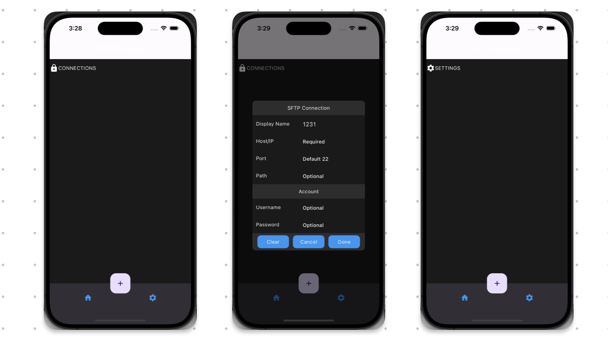

# sftpmanager

This is a simple sftp manager application built using flutter. I wanted to create my own since all the good ones are paid (at least the ones in the app store).

## Environment
Flutter version
```
> flutter --version
Flutter 3.19.5 • channel stable • https://github.com/flutter/flutter.git
Framework • revision 300451adae (2 days ago) • 2024-03-27 21:54:07 -0500
Engine • revision e76c956498
Tools • Dart 3.3.3 • DevTools 2.31.1
```

## Run
Run with `flutter run`

## User Interface

